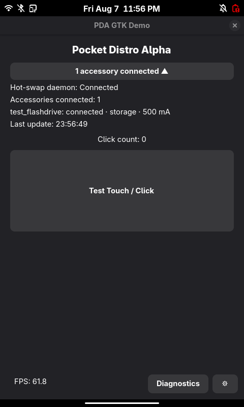

# PDA Demo App

Touch-capable GTK4 reference interface for Pocket Distro Alpha. The demo is
designed for a portrait-oriented display and is used to validate Wayland input,
GTK responsiveness, daemon-status presentation, CPU governor settings,
standalone CPU monitoring, and power benchmark integration.



_Screenshot of the demo app running on Raspberry Pi 5_

## Goals

- Run a GTK4 application under the PDA Wayland environment.
- Verify touch and click input with visible feedback.
- Provide a lightweight FPS indicator for responsiveness checks.
- Display expandable placeholder module status before D-Bus integration is
  complete.
- Save and apply application-level CPU power modes when CPUfreq support is
  available.
- Run INA219 power measurements asynchronously without blocking the GTK main
  loop.
- Provide clearly labeled simulated benchmark data on development systems.
- Monitor CPU governor, frequency, utilization, and temperature without
  modifying system power settings.
- Record CPU monitoring samples asynchronously to CSV.

## Tech Stack

- Wayland environment: Phosh/Phoc
- UI framework: GTK4
- Language: Python with PyGObject
- Input stack: libinput
- Planned daemon communication: D-Bus
- Persistent configuration: JSON in the user's XDG configuration directory
- Power control: Linux CPUfreq governors through an optional `governors` module
- Power measurement: INA219 sampling script or simulated development data
- CPU monitoring: Linux sysfs interfaces and `psutil`

## Current Demo Features

The reference application currently includes:

- an expandable daemon/module status panel using placeholder state
- a large touch/click test button with a click counter
- ripple and dot click-feedback animations
- a lightweight FPS label based on GTK frame-clock ticks
- a full-screen diagnostics overlay
- a power benchmark configuration and execution panel
- a standalone CPU monitoring and CSV logging panel
- a full-screen power mode settings overlay
- persistent JSON settings
- one shared `PowerBackend` facade for settings and benchmark operations

## Project Structure

```text
app/
├── __init__.py
├── module_state.py
├── daemon_status_panel.py
├── click_test_panel.py
├── click_effects.py
├── fps_display.py
├── diagnostics_overlay.py
├── cpu_logger.py
├── cpu_logger_panel.py
├── power_modes.py
├── governor_controller.py
├── power_benchmark_runner.py
├── power_benchmark_panel.py
├── power_backend.py
├── settings_store.py
└── settings_overlay.py
```

### Main Modules

- `app/__init__.py` creates the GTK application window and connects the UI
  components.
- `module_state.py` stores temporary daemon/module state and formats status
  text.
- `daemon_status_panel.py` creates the expandable module status panel.
- `click_test_panel.py` manages the click counter and coordinates click effects
  with the FPS display.
- `click_effects.py` contains the lightweight ripple and dot animation logic.
- `fps_display.py` calculates and displays the GTK frame-clock tick rate.
- `diagnostics_overlay.py` creates the diagnostics and settings overlays.
- `cpu_logger.py` reads CPU governor, frequency, utilization, and temperature
  and records samples to CSV on a background thread.
- `cpu_logger_panel.py` provides standalone CPU monitoring and logging controls
  in the diagnostics overlay.
- `power_modes.py` defines the shared application power modes and governor
  mappings.
- `governor_controller.py` loads the optional governor implementation lazily,
  validates available governors, applies a governor, and verifies the result.
- `power_benchmark_runner.py` runs one benchmark at a time on a background
  thread, writes CSV output, and restores the previous governor.
- `power_benchmark_panel.py` validates benchmark form values and submits a
  `BenchmarkRequest` through `PowerBackend`.
- `power_backend.py` provides the single UI-facing service used by both power
  settings and benchmarks.
- `settings_store.py` validates and atomically saves persistent JSON settings.
- `settings_overlay.py` restores, saves, and attempts to apply the selected
  power mode.

The module status data is still static. It can later be replaced with data from
the hot-swap daemon through D-Bus without changing the main panel layout.

The CPU logger is intentionally independent from `PowerBackend`, power mode
settings, and power benchmark execution. It observes the current CPU state
without changing governors, profiles, workloads, or other system settings.

## Power Architecture

The GTK power layer uses one `PowerBackend` instance. Internally, it delegates:

- CPUfreq operations to `GovernorController`
- benchmark lifecycle and background work to `PowerBenchmarkRunner`

This keeps GTK widgets independent from Linux CPUfreq and subprocess details.
It also ensures that power settings and benchmarks share the same governor
controller and benchmark-running state.

While a benchmark is active, the settings panel prevents the user from changing
the power mode. The benchmark runner records the original governor and attempts
to restore it after the measurement finishes or fails.

CPU logging is separate from this architecture. `CpuLogger` performs read-only
monitoring and does not use `PowerBackend` or `GovernorController`.

## Power Mode Settings

The settings button opens a full-screen power mode panel with these shared
application-level modes:

| Mode ID       | Display name | Governor      |
| ------------- | ------------ | ------------- |
| `default`     | Default      | `schedutil`   |
| `low_power`   | Low Power    | `powersave`   |
| `performance` | Performance  | `performance` |

Selecting **Save and Apply** first saves the selected mode and then attempts to
apply the mapped governor.

Settings are stored in:

```text
$XDG_CONFIG_HOME/pda-demo/settings.json
```

When `XDG_CONFIG_HOME` is not set, the default location is:

```text
~/.config/pda-demo/settings.json
```

Example configuration:

```json
{
    "version": 1,
    "power_mode": "default"
}
```

The saved mode is loaded and applied when the settings controls are created.
If CPUfreq support or the required permissions are unavailable, the application
continues to run and reports the error in the settings panel. Saving the JSON
configuration remains available on development systems such as macOS.

### Governor Integration Requirements

The optional low-level Python module is named `governors` by default. It must
provide these functions:

```python
available_governors()
get_current_governor()
set_governor(governor)
```

Governor changes normally require Linux CPUfreq support and sufficient system
permissions. The UI does not attempt to bypass operating-system permission
requirements.

## Diagnostics

The **Diagnostics** button opens a scrollable diagnostics overlay containing
two independent tools:

- Power Benchmark
- CPU Logging

The Power Benchmark controls configure and execute power measurement tests.
The CPU Logging controls provide read-only monitoring of the current CPU state.
CPU logging does not modify power settings or benchmark configuration.

### Power Benchmark

The benchmark panel supports:

- governor selection from the shared power mode definitions
- workload label selection
- duration from 1 to 3600 seconds
- CSV filename validation
- asynchronous benchmark execution
- visible progress, result, and error messages

The available workload labels are:

- `idle` - idle system or display-off condition
- `display` - active system with the display on
- `peripheral` - attached or active peripheral condition

The current UI records the selected workload as benchmark metadata. It does not
automatically turn the display on or off, create system load, or activate a
peripheral. Prepare the selected workload condition manually before starting a
live measurement.

#### Live INA219 Mode

The runner searches for the sampling script in the expected sibling-repository
layout:

```text
power/hardware/ina219/ina219_sample.py
```

The path can be overridden with:

```bash
export PDA_INA219_SCRIPT=/absolute/path/to/ina219_sample.py
```

The script is launched with:

```text
--seconds <duration> --out <csv-path>
```

The produced CSV must contain these columns:

```text
voltage_V,current_mA,power_mW
```

For live measurements, governor setup must succeed. The runner will not silently
record INA219 data under an unknown governor.

#### Simulated Development Mode

When the INA219 script is not available, the default runner creates clearly
labeled simulated development data. This allows the UI, background thread,
status callbacks, CSV generation, and governor error paths to be tested without
the target hardware.

Simulated values are not valid power measurements and must not be used in the
baseline or optimized power reports.

#### Benchmark CSV Output Location

The benchmark panel currently accepts a filename only. The CSV file is saved
relative to the directory from which the application was launched.

For example, starting the app from `pda-demo-app/` with the default filename
creates:

```text
pda-demo-app/benchmark_idle.csv
```

### CPU Logging

The CPU logging panel runs independently from Power Settings and Power
Benchmark. It does not change the active governor or power profile.

The logger records:

- timestamp
- active CPU governor, when exposed by Linux CPUfreq
- current CPU frequency
- total CPU utilization
- CPU temperature, when exposed by the system

The logger reads the Linux CPUfreq governor from:

```text
/sys/devices/system/cpu/cpu0/cpufreq/scaling_governor
```

and CPU temperature from:

```text
/sys/class/thermal/thermal_zone0/temp
```

CPU frequency and utilization are read through `psutil`.

Logging runs on a background thread so the GTK main loop remains responsive.
The logger samples approximately once per second and supports stopping a
logging session before the configured duration expires.

The default logging duration is:

```text
30 seconds
```

The default output filename is:

```text
cpu_log.csv
```

The CSV contains:

```text
timestamp,governor,cpu_frequency_mhz,cpu_usage_percent,temperature_c
```

For example, on a Linux system with the required CPUfreq and thermal interfaces,
a log may contain:

```csv
timestamp,governor,cpu_frequency_mhz,cpu_usage_percent,temperature_c
1787100000.23,schedutil,1800.00,12.30,51.20
1787100001.24,schedutil,2400.00,45.70,52.10
```

CPU log files are saved relative to the application launch directory unless a
different path is entered.

The CPU logger is designed to tolerate unavailable platform-specific metrics.
On systems that do not expose Linux CPUfreq or thermal sysfs entries, such as
macOS and some virtual machines, unavailable values are left blank in the CSV
and shown as `Unavailable` in the UI.

For example, a development-system log may contain:

```csv
timestamp,governor,cpu_frequency_mhz,cpu_usage_percent,temperature_c
1787101673.49,,3204.00,4.50,
```

This does not indicate a logging failure. It means that the platform did not
provide the corresponding Linux governor or thermal interface.

CPU logging is read-only and normally does not require the elevated permissions
needed to change a CPU governor. Final governor, frequency, and temperature
behavior must still be validated on the Raspberry Pi target.

## Dependencies

### postmarketOS / Alpine Linux

```bash
doas apk add python3 py3-gobject3 gtk4.0 py3-cairo py3-psutil git libadwaita
```

The final packaged application should also include the project package, the
optional governor implementation, and the power sampling script when live power
features are required.

CPU logging requires `psutil` for CPU utilization and frequency information.
Governor and temperature monitoring additionally depend on Linux sysfs
interfaces exposed by the target system.

### macOS Development

```bash
brew install pygobject3 gtk4 uv
```

PyGObject installed by Homebrew is a system Python package. When using a virtual
environment, ensure that the environment can access system site packages.

Project Python dependencies, including `psutil`, are declared in
`pyproject.toml` and managed by `uv`.

One development setup is:

```bash
uv venv --system-site-packages
uv sync
uv run pda-demo-app
```

If an existing environment needs to be recreated:

```bash
uv venv --system-site-packages --clear
uv sync
uv run pda-demo-app
```

## Run

From the `pda-demo-app` directory, development environments with `uv` can run:

```bash
uv run pda-demo-app
```

After the project package is installed, use its console entry point:

```bash
pda-demo-app
```

The console entry point is configured as:

```toml
pda-demo-app = "app:main"
```

in `pyproject.toml`.

The command name is `pda-demo-app`, while `app:main` refers to the Python
package and function used internally as the application entry point.

## Fake HotSwap daemon testing

To run the fake daemon and demo together on a private bus using the new
`pda-demo-app` layout:

```bash
cd ../pda-demo-app
uv venv --system-site-packages --clear
address=$(dbus-daemon --session --print-address --fork)
export DBUS_SYSTEM_BUS_ADDRESS="$address"
python3 app/fake_hotswapd.py &
uv run pda-demo-app
```

If the virtual environment is already created and working, you can skip the
`uv venv` step.

Use the control helper to simulate attachment, detachment, or power changes:

```bash
python3 fake_hotswapd_ctl.py status
python3 fake_hotswapd_ctl.py attach
python3 fake_hotswapd_ctl.py detach
python3 fake_hotswapd_ctl.py power 300
```

If you need a custom control socket path, set:

```bash
export FAKE_HOTSWAPD_CONTROL_SOCKET=/tmp/my-fake-hotswapd.sock
```

## Real-world hotswap daemon testing

For end-to-end validation of the real hot-swap daemon, use the target device
with a real USB storage device attached. The automated tests in the daemon
repository are hardware-free and do not prove attach/detach behavior on real
hardware.

From the `pda-demo-app` directory, switch to the daemon repository and install
and start the service on the target device:

```bash
cd ../../daemon-capstone-submit
sudo make install
sudo systemctl daemon-reload
sudo systemctl restart hotswapd.service
sudo systemctl status hotswapd.service
```

Watch the daemon logs while you test:

```bash
journalctl -u hotswapd.service -f
```

Then perform a simple physical test:

1. Plug in a USB flash drive or USB-C storage device.
2. Wait a few seconds and confirm the device is detected by the system and the
   daemon.
3. Try the CLI helpers:

    ```bash
    hsctl list
    hsctl power
    ```

4. Unmount the device safely if needed and unplug it.
5. Confirm the daemon logs show detach or cleanup activity.
6. Repeat the attach/detach cycle at least three times to check for stability.

For a stronger real-world check, repeat the same sequence with a second device
or with a sudden unplug after a write operation to observe how the daemon behaves
under surprise removal.

## Manual Test Checklist

### Main UI

1. Launch the application and confirm the window shows `Pocket Distro Alpha`.
2. Expand and collapse the daemon/module status panel.
3. Click **Test Touch / Click** and confirm the counter increases.
4. Confirm the ripple and dot feedback appears.
5. Confirm the lower-left FPS label updates.

### Diagnostics and Benchmark

1. Open **Diagnostics** and confirm the overlay receives input.
2. Confirm the Power Benchmark panel is visible.
3. Test invalid duration or filename values and confirm an error is displayed.
4. Start a short benchmark.
5. Confirm the GTK window remains responsive while the worker runs.
6. Confirm the status identifies INA219 or simulated development data.
7. Confirm a CSV file is created in the launch directory.
8. Start another benchmark while one is active and confirm it is rejected.
9. Confirm the previous governor is restored when governor control is
   available.

### CPU Logging

1. Open **Diagnostics** and confirm the CPU Logging panel is visible.
2. Set a short logging duration, such as 5 seconds.
3. Press **Start Logging**.
4. Confirm the GTK window remains responsive while logging runs.
5. Confirm CPU usage and any other available CPU metrics update.
6. Confirm the status changes to **Logging complete** when the configured
   duration expires.
7. Start another logging session and press **Stop** before it finishes.
8. Confirm the session ends and the status reports that logging stopped.
9. Confirm the configured CSV file is created and contains CPU samples.
10. On macOS or a VM without Linux CPUfreq or thermal interfaces, confirm
    unavailable governor or temperature values do not crash the application.
11. Repeat the test on the Raspberry Pi target and confirm governor, frequency,
    CPU utilization, and temperature values are reported when supported.

### Power Mode Settings

1. Open the power mode settings overlay.
2. Select a mode and press **Save and Apply**.
3. Close and reopen the panel and confirm the saved selection is restored.
4. Restart the application and confirm it attempts to apply the saved mode.
5. Confirm governor or permission failures are shown without crashing the app.
6. While a benchmark is running, confirm power mode changes are blocked.

## Performance Notes

The FPS label reports the GTK frame-clock tick rate observed by the demo. It is
useful for quick responsiveness checks, but it is not a formal frame-rate,
latency, or end-to-end touch benchmark.

CPU logging also runs on a background thread to avoid blocking the GTK main
loop. The approximately one-second CPU sampling interval is intended for
lightweight diagnostic monitoring rather than high-frequency performance
profiling.

## Known Limitations

- The daemon/module panel still uses placeholder data and is not yet connected
  to the hot-swap daemon through D-Bus.
- VM mouse input is only a substitute for physical touchscreen testing.
- Portrait display rotation and touch-coordinate alignment require final target
  hardware validation.
- Workload conditions are prepared manually; the benchmark runner only records
  the selected workload label.
- Simulated benchmark output is development-only and is not measurement data.
- Live INA219 execution depends on the external sampling script, hardware
  connection, and permissions.
- CPU governor control depends on Linux CPUfreq support, the external
  `governors` implementation, and permissions.
- CPU governor and temperature monitoring depend on Linux sysfs interfaces and
  may be unavailable on macOS or virtual machines.
- CPU frequency values reported by development systems or virtual machines may
  not represent Raspberry Pi CPUfreq behavior.
- Benchmark and CPU logging CSV files are currently saved relative to the
  process working directory unless another output path is specified.
- Final validation must be repeated on the CM5, target display, compositor,
  touchscreen, CPU monitoring interfaces, and power measurement hardware.

# License

Copyright (C) 2026 Jiesui Chen, Griffin Wintermute

This program is free software: you can redistribute it and/or modify
it under the terms of the GNU General Public License as published by
the Free Software Foundation, either version 3 of the License, or
(at your option) any later version.

This program is distributed in the hope that it will be useful,
but WITHOUT ANY WARRANTY; without even the implied warranty of
MERCHANTABILITY or FITNESS FOR A PARTICULAR PURPOSE. See the
GNU General Public License for more details.

You should have received a copy of the GNU General Public License
along with this program. If not, see <https://www.gnu.org/licenses/>.
